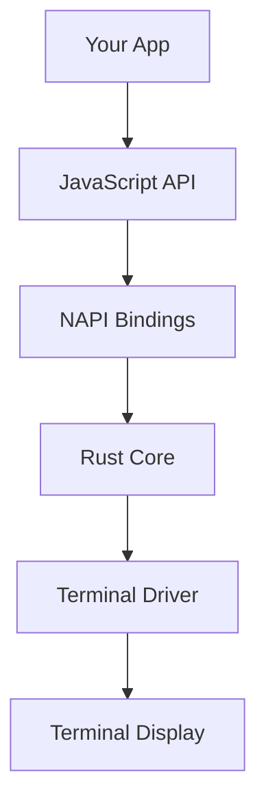

# Core Concepts

Understanding these fundamental concepts will help you build powerful terminal applications with Reactive TUI.

## Architecture Overview

Reactive TUI uses a hybrid architecture combining the best of both worlds:

- **Rust Core**: High-performance rendering engine with NAPI bindings
- **JavaScript/TypeScript Layer**: Developer-friendly API and component system
- **CSS Engine**: Familiar web-like styling with terminal adaptations



## Elements and Components

### Elements

Elements are the building blocks of your TUI application. They represent DOM-like nodes with:

- **Tag names** (div, button, input, etc.)
- **CSS classes** for styling
- **Attributes** for metadata
- **Content** (text or child elements)
- **Event handling** capabilities

```javascript
const element = new JsElement('div');
element.setId('my-element');
element.addClass('container');
element.setContent('Hello World');
element.setAttribute('data-role', 'main');
```

### Component Hierarchy

Elements can contain child elements, creating a tree structure similar to HTML:

```javascript
const app = TuiUtils.div();
app.addClass('app');

const header = TuiUtils.div();
header.addClass('header');
header.setContent('My App');

const content = TuiUtils.div();
content.addClass('content');

const button = TuiUtils.button();
button.setContent('Click Me');
button.makeFocusable(0);

// Build hierarchy
content.addChild(button);
app.addChild(header);
app.addChild(content);
```

## CSS Styling System

### CSS Support

Reactive TUI supports a comprehensive subset of CSS designed for terminal interfaces:

#### Layout Properties
- `display: flex | grid | block`
- `flex-direction`, `justify-content`, `align-items`
- `grid-template-columns`, `grid-template-rows`
- `padding`, `margin`, `border`

#### Visual Properties
- `background`, `color`
- `border` with ASCII art rendering
- `font-weight` (bold/normal)
- `text-align`

#### Responsive Design
```css
@media (max-width: 80) {
  .responsive {
    flex-direction: column;
  }
}
```

### Utility Classes

Reactive TUI includes Tailwind-inspired utility classes:

```css
/* Spacing */
.p-4 { padding: 1rem; }
.m-2 { margin: 0.5rem; }

/* Layout */
.flex { display: flex; }
.grid { display: grid; }
.justify-center { justify-content: center; }

/* Colors */
.bg-primary { background: #007acc; }
.text-white { color: #ffffff; }
```

## State Management

### Reactive State

Reactive TUI provides a built-in state management system:

```javascript
const state = new JsReactiveState();

// Set initial state
const appState = {
  count: 0,
  username: '',
  isLoggedIn: false
};
state.setStateJson(JSON.stringify(appState));

// Update state
const currentState = JSON.parse(state.getStateJson());
currentState.count++;
state.setStateJson(JSON.stringify(currentState));
```

### State Updates and Re-rendering

When state changes, components automatically re-render:

1. State update triggered
2. Change detection occurs
3. Affected components re-render
4. Terminal display updates

## Event System

### Focus Management

Elements can be made focusable for keyboard navigation:

```javascript
const button = TuiUtils.button();
button.makeFocusable(0); // Tab index 0
button.setContent('Focusable Button');
```

### Event Handling

```javascript
// Built-in actions
const actions = {
  quit: Actions.quit,
  refresh: Actions.refresh,
  focusNext: Actions.focusNext,
  activate: Actions.activate
};

// Custom event handling would be implemented
// in the Rust layer for performance
```

## Terminal Adaptation

### Coordinate System

Reactive TUI uses a character-based coordinate system:

- **Width**: Measured in characters (columns)
- **Height**: Measured in lines (rows)
- **Origin**: Top-left corner (0, 0)

### Color Support

Automatic color adaptation based on terminal capabilities:

- **24-bit color** (modern terminals)
- **8-bit color** (standard terminals)
- **ANSI colors** (legacy terminals)
- **Graceful fallback** for limited color support

### Performance Optimization

#### Virtual Rendering

For large datasets, Reactive TUI uses virtual rendering:

```javascript
// Only visible items are rendered
const list = createVirtualList({
  items: largeDataArray,
  itemHeight: 1,
  viewportHeight: 20
});
```

#### Dirty Region Tracking

Only changed areas of the screen are redrawn:

1. Detect changed elements
2. Calculate affected screen regions
3. Update only dirty regions
4. Minimize terminal I/O

## Memory Management

### Automatic Cleanup

Reactive TUI handles memory management automatically:

- **Rust ownership** prevents memory leaks
- **JavaScript GC integration** for cross-language cleanup
- **Resource disposal** when components unmount

### Best Practices

```javascript
// Good: Reuse elements when possible
const elements = [];
for (let i = 0; i < 1000; i++) {
  const item = TuiUtils.div();
  item.setContent(`Item ${i}`);
  elements.push(item);
}

// Add all at once for better performance
elements.forEach(item => container.addChild(item));
```

## Cross-Platform Compatibility

### Platform Support

Reactive TUI runs on all major platforms:

- **Windows** (Windows 10+)
- **macOS** (10.15+)
- **Linux** (glibc 2.17+)
- **Additional platforms** via NAPI targets

### Terminal Compatibility

Works with all modern terminals:

- **Windows Terminal**
- **iTerm2**
- **GNOME Terminal**
- **Konsole**
- **VS Code Terminal**
- **And many more...**

## Next Steps

Now that you understand the core concepts, you're ready to:

- 🏗️ [Follow the Tutorial](./tutorial-basics/create-a-document)
- 📖 [Browse API Reference](./api/overview)
- 🧩 [Explore Examples](./tutorial-basics/markdown-features)